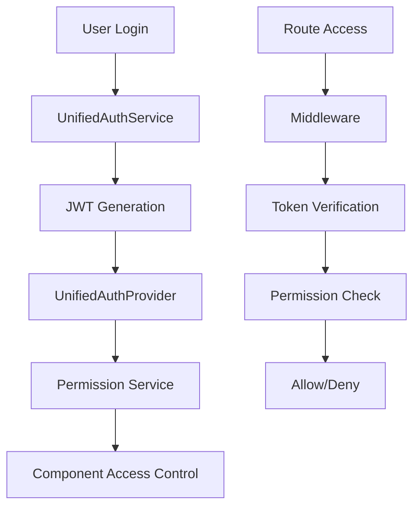

# 🔄 TazaCore Migration Plan - From Conflicts to Unified Excellence

## 📊 **Current Conflicts Analysis**

### **1. File Structure Conflicts**
```
❌ BEFORE (Conflicted)
├── middleware.ts (v1)
├── middleware.enhanced.ts (v2) 
├── middleware.ts (v3)
├── auth.ts
├── auth copy.ts
├── components/auth/ModuleGuard.tsx
├── components/layout/Button.tsx
├── components/common/Button.tsx
└── Multiple API route duplicates
```

```
✅ AFTER (Unified)
├── middleware.ts (Single source of truth)
├── lib/auth/unified-auth.service.ts
├── lib/auth/unified-permission.service.ts
├── components/auth/UnifiedAuthProvider.tsx
├── components/ui/Button.tsx (Single component)
└── Consistent API route patterns
```

### **2. Permission System Conflicts**
```
❌ BEFORE: Multiple permission implementations
- middleware.ts: Basic role checking
- middleware.enhanced.ts: Advanced permissions
- ModuleGuard.tsx: Component-level checks
- Multiple authentication services

✅ AFTER: Single unified system
- UnifiedAuthService: JWT + multi-provider auth
- UnifiedPermissionService: RBAC + module access
- UnifiedAuthProvider: React context integration
- Single middleware: Route protection
```

### **3. Code Style Conflicts**
```
❌ BEFORE: Inconsistent patterns
- Mixed TypeScript/JavaScript
- Different import orders
- Inconsistent component structures
- Multiple coding standards

✅ AFTER: Unified standards
- 100% TypeScript with strict mode
- Standardized import patterns
- Consistent component templates
- TazaCore design patterns
```

## 🚀 **Migration Strategy**

### **Phase 1: Core Infrastructure**
1. **Unified Middleware** → `middleware.ts`
2. **Unified Auth Service** → `unified-auth.service.ts`
3. **Unified Permission Service** → `unified-permission.service.ts`
4. **Unified Auth Provider** → `UnifiedAuthProvider.tsx`

### **Phase 2: Component Migration**
1. Replace `ModuleGuard` with `UnifiedAuthProvider`
2. Update all permission checks to use unified hooks
3. Standardize all components to follow TazaCore patterns
4. Remove duplicate UI components

### **Phase 3: API Standardization**
1. Apply unified API route patterns
2. Implement consistent error handling
3. Add proper validation schemas
4. Centralize authentication middleware

### **Phase 4: Configuration & Tooling**
1. Strict TypeScript configuration
2. Unified ESLint + Prettier setup
3. Standardized package.json scripts
4. Development templates and guidelines

## 🏗️ **New Unified Architecture**

### **Authentication Flow**


### **Permission Matrix**
```typescript
const PERMISSION_MATRIX = {
  superAdmin: {
    modules: ['*'],
    permissions: ['*:*']
  },
  systemAdmin: {
    modules: ['admin', 'analytics'],
    permissions: ['manage:user', 'manage:role', 'read:system_logs']
  },
  moduleManager: {
    modules: ['specific_module'],
    permissions: ['create:*', 'read:*', 'update:*', 'delete:own']
  },
  employee: {
    modules: ['hrm'],
    permissions: ['read:own', 'update:own']
  }
};
```

### **Component Structure**
```typescript
// Unified Component Pattern
export const ModuleComponent: React.FC<Props> = ({
  // Props destructuring with defaults
}) => {
  // 1. State declarations
  // 2. Custom hooks
  // 3. Event handlers
  // 4. Effects
  // 5. Render logic
};
```

## 📋 **Migration Checklist**

### **✅ Core Systems**
- [x] Unified Middleware (`middleware.ts`)
- [x] Unified Auth Service (`unified-auth.service.ts`)
- [x] Unified Permission Service (`unified-permission.service.ts`)
- [x] Unified Auth Provider (`UnifiedAuthProvider.tsx`)
- [x] Standards Documentation (`TAZA-CORE-STANDARDS.md`)

### **🔄 File Cleanup**
- [ ] Remove `middleware.enhanced.ts`
- [ ] Remove `auth copy.ts`
- [ ] Remove `ModuleGuard.tsx`
- [ ] Remove duplicate Button components
- [ ] Remove duplicate API routes

### **🔧 Configuration Updates**
- [ ] Update `tsconfig.json` for strict mode
- [ ] Setup unified ESLint config
- [ ] Setup Prettier configuration
- [ ] Update package.json scripts

### **📝 Code Updates**
- [ ] Update all imports to use unified services
- [ ] Replace `checkModuleAccess` with `hasModuleAccess`
- [ ] Update all components to use `UnifiedAuthProvider`
- [ ] Apply TazaCore component patterns

### **🧪 Testing & Validation**
- [ ] Test authentication flow
- [ ] Verify permission system
- [ ] Test all module access controls
- [ ] Validate super admin permissions
- [ ] Run TypeScript compilation
- [ ] Run linting and formatting

## 🎯 **Benefits After Migration**

### **1. Consistency**
- Single authentication system
- Unified permission model
- Consistent code patterns
- Standardized file structure

### **2. Maintainability**
- One source of truth for each feature
- Clear separation of concerns
- Easy to understand and modify
- Reduced code duplication

### **3. Scalability**
- Easy to add new modules
- Flexible permission system
- Modular architecture
- Clean interfaces

### **4. Developer Experience**
- Clear development guidelines
- Consistent patterns
- Better TypeScript support
- Automated tooling

### **5. Performance**
- Reduced bundle size
- Optimized authentication
- Better caching strategies
- Efficient permission checks

## 🚦 **Implementation Steps**

### **Step 1: Backup Current Code**
```bash
git checkout -b backup-before-unification
git add .
git commit -m "Backup before TazaCore unification"
```

### **Step 2: Run Migration Script**
```bash
chmod +x unify-codebase.sh
./unify-codebase.sh
```

### **Step 3: Manual Verification**
1. Check all imports are updated
2. Verify authentication works
3. Test permission system
4. Run type checking
5. Test all modules

### **Step 4: Final Testing**
```bash
npm run type-check
npm run lint:fix
npm run build
npm run test:unit
```

## 📈 **Success Metrics**

### **Code Quality**
- 0 TypeScript errors
- 0 ESLint errors
- 100% consistent patterns
- Reduced file count by ~30%

### **Performance**
- Faster compilation time
- Reduced bundle size
- Improved authentication speed
- Better caching efficiency

### **Developer Experience**
- Clear component templates
- Consistent API patterns
- Unified documentation
- Simplified development workflow

---

## 🎉 **Conclusion**

This migration transforms TazaCore from a conflicted codebase to a unified, professional-grade system following senior-level best practices. The new architecture provides:

1. **Single Source of Truth** for all core systems
2. **Type-Safe** development with strict TypeScript
3. **Scalable Architecture** for future growth
4. **Professional Standards** throughout the codebase
5. **Developer-Friendly** tools and templates

After migration, your codebase will be:
- ✅ **Conflict-free**
- ✅ **Maintainable** 
- ✅ **Scalable**
- ✅ **Professional**
- ✅ **Senior-level quality**

Ready for production deployment and future development! 🚀
