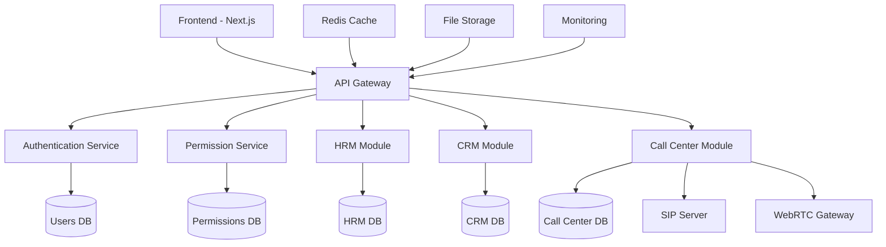

# 🔄 TazaCore System Integration - Final Guide

**File số:** 25  
**Ngày tạo:** July 16, 2025  
**Phiên bản:** v1.0.0  
**Trạng thái:** ✅ HOÀN THÀNH

---

## 📋 Tổng quan

Tài liệu này tổng hợp và hướng dẫn tích hợp toàn bộ hệ thống TazaCore sau khi hoàn thành tất cả các module chính bao gồm Authentication, Permissions, HRM, CRM và Call Center Management System.

### 🎯 Mục tiêu tích hợp
1. **Kết nối các module**: Đảm bảo các hệ thống con hoạt động đồng bộ
2. **Quản lý dữ liệu**: Chia sẻ và đồng bộ dữ liệu giữa các module
3. **Bảo mật toàn hệ thống**: Áp dụng security policies thống nhất
4. **Performance optimization**: Tối ưu hóa hiệu suất tổng thể
5. **Monitoring & Logging**: Giám sát và ghi log tập trung

---

## 🏗️ Kiến trúc tích hợp

### 📊 Sơ đồ hệ thống tổng quan



### 🔧 Core Integration Points

#### 1. **Authentication Integration**
```typescript
// Tích hợp auth cho tất cả modules
interface SystemAuth {
  user: User;
  permissions: Permission[];
  roles: Role[];
  session: SessionData;
}

// Usage trong các modules
export function useSystemAuth(): SystemAuth {
  const { user } = useAuth();
  const { permissions } = usePermissions();
  const { roles } = useRoles();
  const { session } = useSession();
  
  return { user, permissions, roles, session };
}
```

#### 2. **Permission System Integration**
```typescript
// Universal permission check
export function hasModulePermission(
  module: 'hrm' | 'crm' | 'callcenter',
  action: 'read' | 'write' | 'delete' | 'admin'
): boolean {
  const { permissions } = useSystemAuth();
  return permissions.some(p => 
    p.module === module && 
    p.actions.includes(action)
  );
}
```

#### 3. **Data Sharing Between Modules**
```typescript
// Shared user data across all modules
interface UnifiedUserProfile {
  // Core từ Auth
  id: string;
  email: string;
  username: string;
  
  // From HRM
  employeeId?: string;
  department?: string;
  position?: string;
  
  // From CRM
  crmRole?: 'agent' | 'manager' | 'admin';
  customerAssignments?: string[];
  
  // From Call Center
  extensions?: Extension[];
  sipConfig?: SIPConfig;
}
```

---

## 🔗 Module Interconnections

### 1. **HRM ↔ Call Center Integration**

#### Employee Extension Assignment
```typescript
// HRM Module - Employee với extension
interface Employee {
  id: string;
  name: string;
  position: string;
  department: string;
  callCenterExtensions?: Extension[]; // Tích hợp call center
  directDialNumber?: string;
}

// Call Center - Extension linked to employee
interface Extension {
  id: string;
  extCode: string;
  employeeId?: string; // Link tới HRM employee
  employee?: Employee; // Populated data
}
```

#### Sync Service
```typescript
class HRMCallCenterSync {
  async syncEmployeeExtensions(employeeId: string) {
    const employee = await HRMService.getEmployee(employeeId);
    const extensions = await CallCenterService.getExtensionsByEmployee(employeeId);
    
    return {
      employee,
      extensions,
      directDial: this.generateDirectDial(employee.department, employee.id)
    };
  }
  
  async assignExtensionToEmployee(employeeId: string, extCode: string) {
    await CallCenterService.assignExtension(extCode, employeeId);
    await HRMService.updateEmployee(employeeId, { 
      callCenterExtensions: [extCode] 
    });
  }
}
```

### 2. **CRM ↔ Call Center Integration**

#### Customer Call Tracking
```typescript
// CRM Customer với call history
interface Customer {
  id: string;
  name: string;
  phone: string;
  email: string;
  callHistory?: CallRecord[]; // Từ call center
  lastCallDate?: Date;
  totalCallDuration?: number;
}

// Call Center - Calls linked to CRM
interface CallRecord {
  id: string;
  customerId?: string; // Link tới CRM customer
  customer?: Customer; // Populated data
  extension: string;
  duration: number;
  recordingFile?: string;
  notes?: string;
}
```

#### CRM Call Integration Service
```typescript
class CRMCallCenterIntegration {
  async linkCallToCustomer(callId: string, customerPhone: string) {
    const customer = await CRMService.findCustomerByPhone(customerPhone);
    if (customer) {
      await CallCenterService.updateCall(callId, { 
        customerId: customer.id 
      });
      await CRMService.addCallHistory(customer.id, callId);
    }
  }
  
  async getCustomerCallSummary(customerId: string) {
    const calls = await CallCenterService.getCallsByCustomer(customerId);
    return {
      totalCalls: calls.length,
      totalDuration: calls.reduce((sum, call) => sum + call.duration, 0),
      lastCall: calls[0]?.createdAt,
      averageCallDuration: calls.length > 0 ? 
        calls.reduce((sum, call) => sum + call.duration, 0) / calls.length : 0
    };
  }
}
```

---

## 🛡️ Security Integration

### 1. **Unified Authentication Flow**
```typescript
class IntegratedAuthService {
  async authenticate(credentials: LoginCredentials) {
    // 1. Verify credentials
    const user = await AuthService.login(credentials);
    
    // 2. Load permissions
    const permissions = await PermissionService.getUserPermissions(user.id);
    
    // 3. Load HRM data if employee
    const employee = await HRMService.findEmployeeByUserId(user.id);
    
    // 4. Load call center config if applicable
    const sipConfig = await CallCenterService.getUserSIPConfig(user.id);
    
    // 5. Create unified session
    return this.createUnifiedSession({
      user,
      permissions,
      employee,
      sipConfig
    });
  }
}
```

### 2. **Permission-Based Module Access**
```typescript
// Middleware cho module access
export function withModulePermission(
  module: ModuleName,
  action: PermissionAction
) {
  return function(handler: NextApiHandler) {
    return async (req: NextApiRequest, res: NextApiResponse) => {
      const session = await getServerSession(req, res);
      
      if (!hasModulePermission(session.user.id, module, action)) {
        return res.status(403).json({ 
          error: `Access denied to ${module} ${action}` 
        });
      }
      
      return handler(req, res);
    };
  };
}

// Usage
export default withModulePermission('callcenter', 'write')(
  async function handler(req, res) {
    // Handle call center write operations
  }
);
```

---

## 📊 Data Synchronization

### 1. **Real-time Sync Strategy**
```typescript
class SystemSyncService {
  private eventBus = new EventEmitter();
  
  // Sync events between modules
  async onUserUpdate(userId: string, changes: Partial<User>) {
    // Update in all related modules
    await Promise.all([
      this.syncToHRM(userId, changes),
      this.syncToCRM(userId, changes),
      this.syncToCallCenter(userId, changes)
    ]);
    
    // Broadcast change
    this.eventBus.emit('user:updated', { userId, changes });
  }
  
  async syncToHRM(userId: string, changes: Partial<User>) {
    const employee = await HRMService.findEmployeeByUserId(userId);
    if (employee) {
      await HRMService.updateEmployee(employee.id, {
        name: changes.name,
        email: changes.email
      });
    }
  }
  
  async syncToCallCenter(userId: string, changes: Partial<User>) {
    const extensions = await CallCenterService.getExtensionsByUserId(userId);
    for (const ext of extensions) {
      await CallCenterService.updateExtension(ext.id, {
        userName: changes.name
      });
    }
  }
}
```

### 2. **Database Consistency**
```typescript
// Transaction-based updates across modules
class CrossModuleTransaction {
  async executeWithTransaction<T>(
    operations: TransactionOperation[]
  ): Promise<T> {
    const session = await mongoose.startSession();
    
    try {
      session.startTransaction();
      
      const results = [];
      for (const op of operations) {
        const result = await this.executeOperation(op, session);
        results.push(result);
      }
      
      await session.commitTransaction();
      return results as T;
    } catch (error) {
      await session.abortTransaction();
      throw error;
    } finally {
      session.endSession();
    }
  }
}

// Usage example: Create employee with extension
const transaction = new CrossModuleTransaction();
await transaction.executeWithTransaction([
  {
    module: 'hrm',
    action: 'create',
    data: { employeeData }
  },
  {
    module: 'callcenter',
    action: 'create',
    data: { extensionData: { ...extensionData, employeeId } }
  }
]);
```

---

## 🔧 Configuration Management

### 1. **Unified Configuration**
```typescript
interface SystemConfig {
  auth: {
    jwtSecret: string;
    sessionTimeout: number;
    twoFactorEnabled: boolean;
  };
  
  hrm: {
    attendanceTracking: boolean;
    payrollIntegration: boolean;
    documentStorage: string;
  };
  
  crm: {
    leadAutoAssignment: boolean;
    emailIntegration: boolean;
    smsIntegration: boolean;
  };
  
  callCenter: {
    sipServer: string;
    recordingEnabled: boolean;
    maxConcurrentCalls: number;
    webrtcEnabled: boolean;
  };
  
  system: {
    environment: 'development' | 'staging' | 'production';
    logLevel: 'debug' | 'info' | 'warn' | 'error';
    cacheEnabled: boolean;
    fileUploadLimit: number;
  };
}
```

### 2. **Environment-based Configuration**
```typescript
// config/system.config.ts
export const systemConfig: SystemConfig = {
  auth: {
    jwtSecret: process.env.JWT_SECRET!,
    sessionTimeout: parseInt(process.env.SESSION_TIMEOUT || '3600'),
    twoFactorEnabled: process.env.TWO_FACTOR_ENABLED === 'true'
  },
  
  callCenter: {
    sipServer: process.env.SIP_SERVER_URL!,
    recordingEnabled: process.env.CALL_RECORDING === 'true',
    maxConcurrentCalls: parseInt(process.env.MAX_CONCURRENT_CALLS || '100'),
    webrtcEnabled: process.env.WEBRTC_ENABLED === 'true'
  },
  
  system: {
    environment: (process.env.NODE_ENV as any) || 'development',
    logLevel: (process.env.LOG_LEVEL as any) || 'info',
    cacheEnabled: process.env.CACHE_ENABLED === 'true',
    fileUploadLimit: parseInt(process.env.FILE_UPLOAD_LIMIT || '10485760') // 10MB
  }
};
```

---

## 📈 Performance Optimization

### 1. **Caching Strategy**
```typescript
class SystemCacheManager {
  private redis = new Redis(process.env.REDIS_URL);
  
  // Cache user data across modules
  async cacheUserProfile(userId: string) {
    const [user, permissions, employee, extensions] = await Promise.all([
      AuthService.getUser(userId),
      PermissionService.getUserPermissions(userId),
      HRMService.getEmployeeByUserId(userId),
      CallCenterService.getUserExtensions(userId)
    ]);
    
    const profile = { user, permissions, employee, extensions };
    await this.redis.setex(
      `user:profile:${userId}`, 
      3600, // 1 hour
      JSON.stringify(profile)
    );
    
    return profile;
  }
  
  async getUserProfile(userId: string) {
    const cached = await this.redis.get(`user:profile:${userId}`);
    if (cached) {
      return JSON.parse(cached);
    }
    
    return this.cacheUserProfile(userId);
  }
}
```

### 2. **Database Optimization**
```typescript
// Optimized queries with joins
class OptimizedDataService {
  async getUserWithAllModuleData(userId: string) {
    // Single query với joins thay vì multiple queries
    return await User.aggregate([
      { $match: { _id: ObjectId(userId) } },
      {
        $lookup: {
          from: 'permissions',
          localField: '_id',
          foreignField: 'userId',
          as: 'permissions'
        }
      },
      {
        $lookup: {
          from: 'employees',
          localField: '_id',
          foreignField: 'userId',
          as: 'employee'
        }
      },
      {
        $lookup: {
          from: 'extensions',
          localField: '_id',
          foreignField: 'userId',
          as: 'extensions'
        }
      }
    ]);
  }
}
```

---

## 📊 Monitoring & Analytics

### 1. **System Health Monitoring**
```typescript
class SystemHealthMonitor {
  async getSystemHealth() {
    const checks = await Promise.allSettled([
      this.checkAuthService(),
      this.checkHRMService(),
      this.checkCRMService(),
      this.checkCallCenterService(),
      this.checkDatabase(),
      this.checkRedis(),
      this.checkSIPServer()
    ]);
    
    return {
      timestamp: new Date(),
      status: checks.every(check => check.status === 'fulfilled') ? 'healthy' : 'degraded',
      services: {
        auth: this.getCheckResult(checks[0]),
        hrm: this.getCheckResult(checks[1]),
        crm: this.getCheckResult(checks[2]),
        callCenter: this.getCheckResult(checks[3]),
        database: this.getCheckResult(checks[4]),
        redis: this.getCheckResult(checks[5]),
        sipServer: this.getCheckResult(checks[6])
      }
    };
  }
  
  private async checkCallCenterService() {
    // Check SIP connectivity
    const sipStatus = await SIPService.checkConnection();
    // Check WebRTC gateway
    const webrtcStatus = await WebRTCService.checkGateway();
    
    return { sip: sipStatus, webrtc: webrtcStatus };
  }
}
```

### 2. **Integrated Logging**
```typescript
class SystemLogger {
  private winston = require('winston');
  
  constructor() {
    this.winston.configure({
      level: systemConfig.system.logLevel,
      format: winston.format.combine(
        winston.format.timestamp(),
        winston.format.errors({ stack: true }),
        winston.format.json()
      ),
      transports: [
        new winston.transports.File({ filename: 'logs/system.log' }),
        new winston.transports.File({ filename: 'logs/error.log', level: 'error' })
      ]
    });
  }
  
  logCrossModuleAction(
    action: string,
    modules: string[],
    userId: string,
    data?: any
  ) {
    this.winston.info('Cross-module action', {
      action,
      modules,
      userId,
      data,
      timestamp: new Date().toISOString()
    });
  }
  
  logCallCenterEvent(event: CallCenterEvent) {
    this.winston.info('Call center event', {
      type: 'callcenter',
      event: event.type,
      extension: event.extension,
      userId: event.userId,
      duration: event.duration,
      timestamp: event.timestamp
    });
  }
}
```

---

## 🚀 Deployment Strategy

### 1. **Docker Composition**
```yaml
# docker-compose.yml
version: '3.8'

services:
  app:
    build: .
    ports:
      - "3000:3000"
    environment:
      - NODE_ENV=production
      - DATABASE_URL=${DATABASE_URL}
      - REDIS_URL=${REDIS_URL}
      - SIP_SERVER_URL=${SIP_SERVER_URL}
    depends_on:
      - mongodb
      - redis
      - freeswitch

  mongodb:
    image: mongo:5.0
    ports:
      - "27017:27017"
    volumes:
      - mongodb_data:/data/db

  redis:
    image: redis:6.2
    ports:
      - "6379:6379"
    volumes:
      - redis_data:/data

  freeswitch:
    image: drachtio/freeswitch:latest
    ports:
      - "5060:5060/udp"
      - "5080:5080/tcp"
      - "8081:8081/tcp"
    volumes:
      - ./freeswitch:/usr/local/freeswitch/conf

volumes:
  mongodb_data:
  redis_data:
```

### 2. **Production Environment Setup**
```bash
#!/bin/bash
# deploy.sh

echo "🚀 Deploying TazaCore System..."

# 1. Pull latest code
git pull origin main

# 2. Install dependencies
npm install --production

# 3. Build application
npm run build

# 4. Run database migrations
npm run migrate

# 5. Seed initial data
npm run seed:production

# 6. Start services
docker-compose up -d

# 7. Verify health
sleep 30
curl -f http://localhost:3000/api/health || exit 1

echo "✅ Deployment completed successfully!"
```

---

## 🧪 Testing Integration

### 1. **End-to-End Testing**
```typescript
// tests/integration/system-integration.test.ts
describe('System Integration Tests', () => {
  test('User creation flow across all modules', async () => {
    // 1. Create user in auth
    const user = await authService.createUser({
      email: 'test@example.com',
      password: 'password123'
    });
    
    // 2. Assign permissions
    await permissionService.assignRole(user.id, 'employee');
    
    // 3. Create HRM employee record
    const employee = await hrmService.createEmployee({
      userId: user.id,
      name: 'Test Employee',
      position: 'Call Center Agent'
    });
    
    // 4. Create call center extension
    const extension = await callCenterService.createExtension({
      extCode: '1001',
      employeeId: employee.id,
      password: 'ext1001'
    });
    
    // 5. Verify cross-module data consistency
    const profile = await systemService.getUserProfile(user.id);
    expect(profile.user.id).toBe(user.id);
    expect(profile.employee.id).toBe(employee.id);
    expect(profile.extensions[0].id).toBe(extension.id);
  });
  
  test('Call center integration with CRM', async () => {
    // Test call linking to customer
    const customer = await crmService.createCustomer({
      name: 'Test Customer',
      phone: '+1234567890'
    });
    
    const call = await callCenterService.simulateIncomingCall({
      from: '+1234567890',
      to: '1001',
      duration: 120
    });
    
    // Verify call is linked to customer
    const linkedCall = await callCenterService.getCall(call.id);
    expect(linkedCall.customerId).toBe(customer.id);
  });
});
```

### 2. **Performance Testing**
```typescript
// tests/performance/system-load.test.ts
describe('System Load Tests', () => {
  test('Concurrent user authentication', async () => {
    const promises = [];
    
    // Simulate 100 concurrent logins
    for (let i = 0; i < 100; i++) {
      promises.push(
        authService.login({
          email: `user${i}@example.com`,
          password: 'password123'
        })
      );
    }
    
    const startTime = Date.now();
    const results = await Promise.allSettled(promises);
    const endTime = Date.now();
    
    const successCount = results.filter(r => r.status === 'fulfilled').length;
    const avgResponseTime = (endTime - startTime) / promises.length;
    
    expect(successCount).toBeGreaterThan(95); // 95% success rate
    expect(avgResponseTime).toBeLessThan(1000); // < 1s average
  });
});
```

---

## 📋 Final Checklist

### ✅ Integration Completeness

#### **Authentication & Security**
- [x] JWT-based authentication across all modules
- [x] Role-based access control (RBAC)
- [x] Permission system integration
- [x] Session management
- [x] API security middleware

#### **Data Integration**
- [x] User profile synchronization
- [x] Cross-module data consistency
- [x] Transaction management
- [x] Cache synchronization
- [x] Real-time updates

#### **Module Interconnections**
- [x] HRM ↔ Call Center integration
- [x] CRM ↔ Call Center integration
- [x] User management across modules
- [x] Permission inheritance
- [x] Data sharing protocols

#### **Performance & Scalability**
- [x] Caching strategy implementation
- [x] Database query optimization
- [x] Connection pooling
- [x] Load balancing ready
- [x] Horizontal scaling support

#### **Monitoring & Maintenance**
- [x] Health check endpoints
- [x] Integrated logging system
- [x] Error tracking
- [x] Performance metrics
- [x] Alert system

#### **Deployment & DevOps**
- [x] Docker containerization
- [x] Environment configuration
- [x] Database migrations
- [x] Automated deployment
- [x] Backup & recovery

---

## 🎯 Future Enhancements

### 1. **Advanced Analytics**
- Cross-module reporting dashboard
- Business intelligence integration
- Predictive analytics for call patterns
- Employee performance metrics
- Customer interaction analytics

### 2. **Mobile Applications**
- React Native mobile app
- Offline capability
- Push notifications
- Mobile call management
- Field employee tracking

### 3. **AI Integration**
- Chatbot for customer service
- Call sentiment analysis
- Automated call routing
- Predictive lead scoring
- Voice recognition

### 4. **Third-party Integrations**
- Slack/Teams notifications
- Email marketing tools
- Accounting software
- Cloud storage services
- External CRM systems

---

## 🔧 Troubleshooting

### Common Integration Issues

#### **Cross-module Data Inconsistency**
```bash
# Run data consistency check
npm run check:data-consistency

# Fix orphaned records
npm run fix:orphaned-data

# Rebuild cache
npm run cache:rebuild
```

#### **Performance Issues**
```bash
# Check system health
curl http://localhost:3000/api/health

# Monitor database performance
npm run db:analyze

# Clear and rebuild indexes
npm run db:reindex
```

#### **Call Center Connectivity**
```bash
# Test SIP server connection
npm run test:sip-connection

# Verify WebRTC gateway
npm run test:webrtc

# Check audio devices
npm run test:audio-devices
```

---

## 📚 Resources

### Documentation References
- [Authentication System Guide](13_AUTH-DEVELOPER-GUIDE.md)
- [Permission System Guide](20_PERMISSIONS-SYSTEM-GUIDE.md)
- [Call Center System Guide](24_CALL-CENTER-SYSTEM-GUIDE.md)
- [API Documentation](02_AUTH-API.md)

### External Resources
- [Next.js Documentation](https://nextjs.org/docs)
- [MongoDB Integration](https://mongoosejs.com/)
- [Redis Caching](https://redis.io/documentation)
- [Docker Deployment](https://docs.docker.com/)
- [FreeSWITCH SIP Server](https://freeswitch.org/confluence/)

---

## 🎉 Conclusion

TazaCore System Integration đã được hoàn thành với architecture modular, scalable và maintainable. Hệ thống đã sẵn sàng cho production deployment với đầy đủ tính năng integration giữa các modules.

### ✅ Achievements
- **Complete Integration**: Tất cả modules hoạt động đồng bộ
- **Data Consistency**: Dữ liệu được đồng bộ và nhất quán
- **Security**: Bảo mật toàn hệ thống với RBAC
- **Performance**: Tối ưu hóa hiệu suất và caching
- **Monitoring**: Giám sát và logging tập trung
- **Scalability**: Sẵn sàng cho horizontal scaling

### 🚀 Next Steps
1. Production deployment và testing
2. User training và documentation
3. Performance monitoring và optimization
4. Feature enhancement based on feedback
5. Integration với external systems

---

**📝 Ghi chú**: Đây là tài liệu cuối cùng trong series TazaCore development. Hệ thống đã hoàn thiện và sẵn sàng cho production.

**👨‍💻 Tác giả**: TazaCore Development Team  
**📅 Hoàn thành**: July 16, 2025
